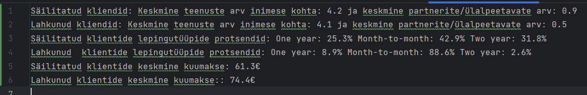

# Kliendi Lahtiütlemise Ennustamine

Et ennustada tõenäosust, et klient võib peagi koostöö ettevõttega lõpetada, olen välja töötanud järgmise meetodi:

## Meetodi Ülevaade

1. **Peamiste Tegurite Määratlemine** - Esimene samm on määratleda peamised tegurid, mis võivad mõjutada kliendi otsust lõpetada koostöö. Need tegurid võivad hõlmata klienditeeninduse kvaliteeti, toote või teenuse hinda, konkurentide pakkumisi ja palju muud.

2. **Tegurite Analüüs** - Järgmine samm on analüüsida neid tegureid, võrreldes andmeid klientide kohta, kes on juba koostöö lõpetanud, nendega, kes jätkuvalt ettevõttega suhtlevad. See aitab tuvastada mustreid ja trende, mis võivad viidata kliendi lahkumise tõenäosusele.

3. **Tarkvaralahenduse Loomine** - Lõpuks luuakse tarkvaralahendus, mis suudab kliendiinfo analüüsides tuvastada, kas ta on lähedal ettevõtte teenustest loobumisele.

## 1. Peamiste Tegurite Määratlemine

### Kliendi Lahkumise Riski Hindamine

Pärast klientide andmete analüüsimist jõudsin järeldusele, et järgmised aspektid on võtmetähtsusega kliendi lahkumise riski hindamisel:

#### Võtmeaspektid

1. **Kasutatavate teenuste arv** - Peegeldab kliendi kaasatust ja huvi pikaajaliseks koostööks ettevõttega, mis võib viidata soovile jätkata suhteid.

2. **Partneri või ülalpeetava olemasolu** - Võib viidata kliendi soovile stabiilsuse ja usaldusväärsuse järele teenustes, mis on oluline koostöö jätkamiseks.

3. **Lepingu tüüp** - Aitab mõista, millised koostöötingimused vähim rahuldavad klientide vajadusi, mis on kriitiline nende hoidmiseks.

4. **Kuutasu suurus** - Annab teavet selle kohta, millised finantstingimused on klientide jaoks vastuvõetavad, mis võib aidata optimeerida hinnakujundust.

## 2. Tegurite Analüüs ("file_to_analyze.txt" põhjal)

Failis 'main.ipynb' käivitame järjest kõik funktsioonid, mis täidavad faile ülesandes antud faili põhjal 'initial.csv'. Pärast kõikide meetodite käivitamist on täidetud failid 'churn.csv' - kõik lahkunud kliendid, 'retention.csv' - jäänud kliendid, 'file_to_analyse.csv' - fail lahkunud ja jäänud klientide peamiste teguritega.

1. **Teenuste kasutamine** - Säilitatud klientide keskmine teenuste arv inimese kohta (4.2) on veidi kõrgem kui lahkunud klientidel (4.1), mis võib viidata sellele, et suurem teenuste kasutamine võib soodustada klientide säilimist.
2. **Partnerid/Ülalpeetavad** - Säilitatud klientidel on keskmiselt rohkem partnereid või ülalpeetavaid (0.9) võrreldes lahkunud klientidega (0.5). See võib näidata, et kliendid, kellel on rohkem sotsiaalseid või majanduslikke sidemeid, kipuvad teenuseid kauem kasutama.
3. **Lepingutüübid** - Suurim erinevus säilitatud ja lahkunud klientide vahel on lepingutüüpides. Säilitatud klientidel on levinumad üheaastased (25.3%) ja kaheaastased (31.8%) lepingud, samas kui lahkunud klientidel domineerib kuupõhine leping (88.6%). See tugevalt viitab sellele, et pikemaajalised lepingud aitavad kaasa klientide lojaalsusele ja vähendavad lahkumise tõenäosust.
4. **Keskmine Kuumakse** - Säilitatud klientide keskmine kuumakse on 61.3€, samal ajal kui lahkunud klientidel on see kõrgem - 74.4€. See erinevus võib peegeldada rahulolematust hinnakujundusega.

## 3. Lahendus

Viimane meetod 'main.ipynb' failis - find_potential_churn() tuvastab potentsiaalselt lahkuvad kliendid, lähtudes järgmistest kriteeriumitest:
Kui kliendi kasutatavate teenuste arv on väiksem või võrdne 4.1-ga, kui kliendil on partner või ülalpeetavaid ja nende arv on 1 või 0, kui kliendi lepingutüüp on "Month-to-month" ning kui kliendi kuumakse on suurem kui 74.4€.
Kui klient vastab neile kõigile kriteeriumitele, loetakse ta potentsiaalseks lahkujaks ja tema andmed salvestatakse faili 'potential.csv'. Ülesannes antud andmete põhjal nende klientide hulk on 278 inimest.